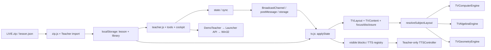

# WEB LIVE — audit kiến trúc hiện hành

Baseline: `TV_VERTICAL_MCQ_CANDIDATE`, ZIP SHA-256 `1ccce4f35bf807e498bdf13ca3275e660faa7b50842298ffdeb825e8a3ed917f`. Mọi đường dẫn source dưới đây tương đối với thư mục gốc trong [freeze report](WEB_LIVE_BASELINE_FREEZE_REPORT.md). Đây là kết quả audit, không phải code kiến trúc mới.

## Kết luận

Source đã có **một Teacher, một TV renderer và ba nhánh presentation theo môn**. Tách thành một CORE và ba profile khả thi theo từng bước; việc trích CORE hiện đánh giá `PARTIAL` vì scene Hình, policy Tin, state và DOM globals vẫn đan xen. Không có bằng chứng buộc phải nhân ba engine.

## Entry, runtime và dependency

| Thành phần | Bằng chứng xác minh | Hành vi |
|---|---|---|
| Khởi động Windows | `START_WEB_LIVE.bat:19–29`; `LAUNCHER/start_web_live.py:79–98,181–197` | Python 3.10+, khởi động HTTP và Launcher, mở Teacher một lần theo instance |
| HTTP chính | `web_live_http.py:12–21,57–89,98–105` | Bind loopback 47382; `/` redirect Teacher; `/WEB_LIVE/*`; health; no-store; Host/Origin checks |
| Entry HTML | `WEB_LIVE/index.html:1` | Meta refresh về Teacher, không phải SPA router |
| Teacher | `teacher.html:31,236–238`; `teacher.js:2,11–29,37–58` | Iframe preview, điều khiển bài, popup TV, shared state và controller tools |
| TV/student | `tv.html:19–49,53`; `tv.js:72–149` | Nhận state, load/cache lesson, render disclosure, layout, visual, overlays và registry TTS |
| Script globals | Dependency list trong [ENTRYPOINT_DEPENDENCIES.json](evidence/ENTRYPOINT_DEPENDENCIES.json) | Classic scripts theo thứ tự, không ESM/DI/module loader, không bundler |
| API Demo | `WebLiveLauncher.py:443–550` | `/status` GET; `/pair`, `/launch`, `/present`, `/return` POST; token/origin/whitelist |

Các đường dẫn Python import lẫn nhau là dependency thật: `start_web_live → web_live_http`; `WebLiveLauncher → windows_handoff + web_live_http`. Không có backend dạy học/database server. Backend Python cung cấp local HTTP và mở ứng dụng Windows. Không cần npm build để chạy HTML/JS/CSS.

Diagram là dependency hiện hành: resolver gọi trong model; các engine là presentation hooks, chưa là profile có lifecycle/state riêng.

## Controller, navigation, state và router

Teacher giữ `lesson/i/lessonActivation/stateVersion/showHint/answerMode/answerStep/analysisStep/viewMode/zoom/pan/pointer` và controller tools trong globals (`teacher.js:2`). `start` tạo activation mới, rebuild scene, reset disclosure và tools. `go/next/prev/jumpTo` thay index có clamp, reset view, gọi `screenChanged`, render và sync (`39–40`). Không có URL route cho từng lesson/step.

`state()` dựng packet chung gồm source key, activation, version, scene, index, metadata nhẹ, hint/answer/analysis, view, board/cover/smart/classroom (`37`). `sync()` ghi localStorage, gửi BroadcastChannel và postMessage cho TV/preview (`38`). TV từ chối stateVersion cũ trong cùng activation (`tv.js:74`), kiểm lesson/source/activation khi nhận lesson packet (`136`). Kênh `web-live-v04`, key `webLiveStateV042` (`common.js:1–6`) là contract tương thích cần giữ.

**Router môn hiện hành** là `resolveSubjectLayout`, không phải HTTP router. Thứ tự: `screen.subjectMode/layoutEngine/presentation.subjectMode → lesson.subjectMode/layoutEngine`, rồi nhãn môn/section/title, geometry flags, type đặc thù và một heuristic tiêu đề Đại số (`tv-layout-model.js:2–22`). Tên nội bộ: `COMPUTER_SCIENCE/ALGEBRA/GEOMETRY/GENERIC`. Không đọc `subject_engine`.

Runtime probe xác minh metadata mới một mình trả GENERIC, explicit cũ override suy đoán, plain math mơ hồ trả GENERIC. Teacher không load resolver này; `pedagogy.js:18` dùng regex môn Hình làm fallback. Ca explicit GEOMETRY + `subject='Toán 8'` và answer steps cho Teacher `ANSWER`, TV `PROOF`: [ARCHITECTURE_RUNTIME_PROBES.json](evidence/ARCHITECTURE_RUNTIME_PROBES.json). Không sửa trong Phase 1.

## Lesson loader, schema, storage và dữ liệu

`zip.js:2–28` đọc ZIP central directory; hỗ trợ stored/deflate-raw và data descriptor qua directory; từ chối ZIP64, password, duplicate/path traversal, item >30MiB hoặc tổng khai báo >70MiB. Browser kiểm size, **không kiểm CRC**. Audit độc lập kiểm CRC ZIP gốc và gói bài; chưa thay importer.

`importZip:54–74` yêu cầu đúng một lesson.json ở root hoặc subfolder; parse manifest.json nếu có nhưng không xác thực toàn bộ manifest/hashes/schema. Embed PNG/JPG/JPEG/SVG của bốn trường visual vào data URL; thiếu ảnh thì báo lỗi. JSON direct phải có ảnh nhúng; relative assets yêu cầu nhập ZIP (`teacher.js:23`). Không có JSON Schema validator; `validateLesson:53` chỉ yêu cầu `screens[]` không rỗng.

`saveLesson:38–50` thêm `_runtimeSourceKey` từ FNV64 fingerprint, thêm/điều chỉnh runtime ID khi collision, ghi `lesson:<id>` và `webLiveLibrary`. Đây là mutation **đối tượng trong bộ nhớ/storage khi import theo hành vi baseline**, không sửa lesson.json/ZIP trên đĩa. FNV64 không phải SHA-256 integrity của Phase 1. Quota localStorage có thể chặn bài lớn; chưa có IndexedDB/service worker hay server persistence.

Hai loại schema đang dùng song song: bài Hình legacy chủ yếu title/content/hint/answer/steps/visuals và scene; Tin RC3 thêm preparedContract/pedagogyFlow/Locks/Policy/sgkTrace và guidance. Không tự coi các field trong source package là tính năng runtime: `lessonOpeningGate/noPreteachCheck/sgkKnowledgeMap/sgkStructureLock` chưa thấy consumer trong JS. Giữ nguyên và đánh dấu metadata có semantics runtime chưa xác minh.

| Gói hiện có | Màn | Bằng chứng hiện hành |
|---|---:|---|
| TIN6_W04_LIVE_RC3_PED1 | 41 | Import ZIP + 82 trạng thái |
| TIN6_W05_LIVE_RC3_PED1 | 32 | Import ZIP + 64 trạng thái |
| TIN8_W04_LIVE_RC3_PED1 | 29 | Import ZIP + 58 trạng thái |
| HINH_HOC_8_T04_T07_LIVE_TEST | 34 | Import ZIP + 68 trạng thái |
| HINH_HOC_8_T04_T07_DUAL_VISUAL_TEST | 35 | Import ZIP + 70 trạng thái |
| DEMO_TRUC_TIEP_SAMPLE_LIVE | 4 | Import + navigation 4 màn; native launch UNRUN |

Inventory đọc toàn bộ lesson entries/field/type và SHA: [LESSON_PACKAGE_INVENTORY.json](evidence/LESSON_PACKAGE_INVENTORY.json). Tổng 175 màn trong 6 package. Không có gói Đại số SGK thực tế; test Algebra trong source và audit engine là fixture trình bày, không phải curriculum package.

## Renderer, Teacher/TV và disclosure

Teacher render surface tools/guidance; student preview và popup dùng cùng `tv.html`. `tv.js:83–134` resolve scene, paint title/content và chỉ slice steps đã reveal, render focus, rồi `TVLayout.apply`, overlay và fit/registry. `TVLayout:102–130` chọn stage/disclosure, single task focus, gọi `TVMultiEngine.apply`, loại region phụ khi answer/knowledge và polish Algebra. DOM IDs là dependency của nhiều module.

Hint/answer thuộc Teacher commands (`teacher.js:41–46`), Tin close gate và hint 1/2 từ `pedagogy.js:2–13`, `pedagogy-teacher.js:41–58`. Knowledge close bắt đầu ẩn. Navigation không tự reveal/advance. Teacher sidebar có thể xem đáp án/guidance trước, nhưng TV/TTS chọn region được disclosed. `restorePedagogySession` resume đúng source/index và clock; reset disclosure, không mở lại app/tool đang dở.

`TVContent` cung cấp semantic MCQ/knowledge chung; Algebra polish riêng (`tv-content.js:4–69,71–120,138–190`). MCQ hiện **một option/một hàng full cognitive width** (`tv-ui.css:205,262–268`), instruction sibling riêng. Không adaptive MCQ columns. Knowledge grid vẫn có phân trang/card và nhiều cột; không đánh đồng với MCQ.

TTS engine duy nhất ở Teacher: `tts-controller.js` Web Speech, owner lease, rate/voice/settings/stop; `tts-tv.js` chỉ collect visible DOM và highlight. `tts-presentation` ràng buộc lesson/source/activation/index. Renderer future phải xuất cùng semantic blocks để giữ parity; không đọc notes/sidebar/hidden pages.

## Scene, zoom, drawing và capability Hình

`common.js:8–97` chứa scene resolver gắn Hình trong file chung. Explicit `sceneId/sceneStart/sceneEnd/imageMode` có priority; legacy dựa bài/title/type/tên ảnh. Cache WeakMap theo lesson; analysis riêng từng screen, không thay base geometry. Hình được kế thừa trong cùng scene khi predicate cho phép; không khẳng định mọi màn luôn giữ hình. `imageMode='none'`, scene mới/end hoặc lesson mới có quyền reset.

Zoom/pan/pointer baseline reset ở `resetView` mỗi screen; range zoom .7–2 (`teacher.js:10,32–36,48`). Hình vẫn tồn tại qua scene nhưng viewport không tự giữ mức zoom. Core/profile design phải phân biệt hai thứ.

DrawBoard tạo point/segment/line/circle/marker/label, references giữa object, undo/redo 80, label/point drag preview không ghi storage mỗi frame. Whiteboard scope theo screen, overlay scope theo scene. CoverLayer scope dựa DrawBoard; SmartGeometry dựa board points/lines để vẽ parallel/perpendicular/equal segment/angle/midpoint. Classroom highlight hiện chỉ point/segment/triangle bằng tọa độ normalized; chưa có semantic highlight mọi điểm/cạnh/góc từ tên trong chứng minh. Không nhận dạng pixel raster.

Thứ tự layer thật: `pic → coverLayer → smartLayer → drawOverlay → classroomHighlight → pointer` (`tv.html:27–32` và assertion runtime). Geometry/profile phải tôn trọng transform chung `figureInner`, pointer inverse CTM, interaction lock và snapshot revision. Board/cover/smart còn tạo controller toàn cục cho mọi môn, chưa có isolation theo lifecycle profile.

## MathJax, media, animation và packaging

Không có MathJax/KaTeX import/config/typeset ở code hiện hành; runtime `typeof MathJax` undefined cả hai màn. `math-atomic.js` giữ relation ngắn nowrap; `TVContent.tokens` trình bày Unicode/plain Algebra, không solver; `math-speech.js` AST giới hạn chỉ phục vụ lời đọc. SYSTEM chỉ nhóm hai dòng equation kề nhau, GRAPH hiển thị ảnh có sẵn; chưa có graph solver/transform verifier.

Media hiện có: ảnh static nhúng từ ZIP; SVG annotations; native Word/GeoGebra Demo. Không thấy audio/video player, web GeoGebra iframe, canvas animation engine hay timeline lesson; iframe duy nhất là preview. Animation hiện là CSS transition opacity/background/progress và rAF cho drag/fit; đồng hồ/presence/poll dùng timers. Các năng lực multimedia rộng hơn là design future, không gán PASS hiện tại.

Packaging hiện hành gồm static WEB_LIVE + Python/BAT/config/demos; package bài là ZIP data riêng. Word `.docx` và GeoGebra `.ggb` tồn tại, CRC PASS; chúng không phải native acceptance. Pairing config và runtime-config phải đi theo cùng package; không chép key vào lesson/report. `package_fingerprint` trong local HTTP hash **đường dẫn cài đặt**, không chứng minh byte version. ZIP SHA và asset hash audit mới là integrity của source.

Demo chỉ refresh/pair khi đổi màn, không `/launch` trước thao tác GV+confirm (`demo-teacher.js:56–64,159–170`). Launcher whitelist hai app; kiểm file dưới demos, token/HMAC, actual Windows monitor/window logic. Phase 1 không thay đổi cơ chế mở ứng dụng. Tại HTTP audit 8770, API native không được giả lập và báo offline; không coi đó là regression hay native PASS.

## Gaps/risk cần ghi nhận

| ID | Phân loại | Bằng chứng | Tác động / đề xuất cho phase sau |
|---|---|---|---|
| B01 | ARCHITECTURE_COUPLING | Teacher globals, mixed common/pedagogy/classroom, globals renderer; 53-file inventory | Trích CORE phải có bridge; không big-bang di chuyển file |
| B02 | METADATA_GAP | subject_engine probe GENERIC; resolver không đọc field | Thêm resolution service dùng chung qua adapter, giữ đường legacy |
| B03 | REPRODUCED_BEHAVIOR | Teacher ANSWER / TV PROOF cùng fixture explicit Geometry | Thiết kế resolver/stage parity; chưa patch |
| B04 | ACCEPTANCE_DATA_GAP | 6 packages, không package Algebra thật | Chặn chứng nhận Algebra production; fixture chỉ chứng minh presentation |
| B05 | PLATFORM_UNRUN | Linux, 0 voices, chưa Win32/app/TV thật | Native regression phải làm trước release của phase implementation |
| B06 | CAPABILITY_GAP | MathJax undefined; không general media/timeline/semantic geometry IDs | Module tùy chọn và contract opt-in; không tự suy diễn tài nguyên |
| B07 | COMPATIBILITY_RISK | minimal schema, FNV source key, origin-dependent storage, global CSS cascade | Giữ validator legacy/key/origin; kiểm collision/quota/CSS trong matrix |

Không có blocker ngăn hoàn tất audit/design Phase 1. B04/B05 chặn kết luận acceptance rộng; B01/B02/B03 là điều kiện phải giải quyết trong candidate được duyệt. Không vấn đề nào được tự sửa.

Bằng chứng chạy mới: [ENGINE_AUDIT/results.json](evidence/ENGINE_AUDIT/results.json), [runtime probes](evidence/ARCHITECTURE_RUNTIME_PROBES.json), [syntax](evidence/JS_SYNTAX_AUDIT.json). 342 trạng thái của 5 gói không overflow đo được, 44 captures; 15 + 20 assertions PASS, page errors 0. Đây là baseline characterization, chưa phải regression của CORE mới vì CORE chưa implement.
