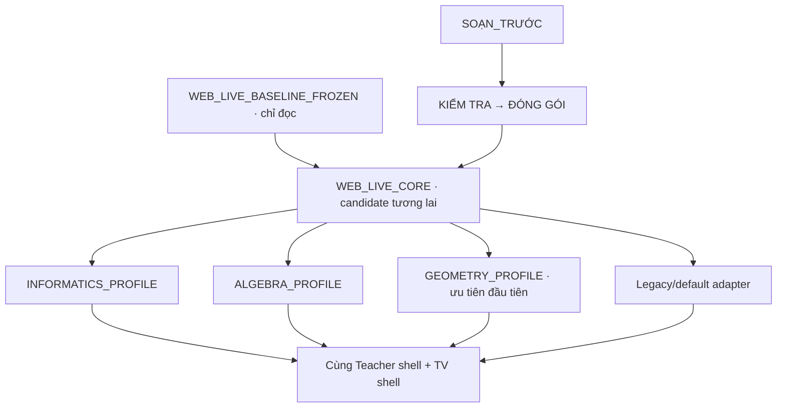

# WEB LIVE — thiết kế một CORE và ba profile

Baseline `TV_VERTICAL_MCQ_CANDIDATE`, SHA-256 `1ccce4f35bf807e498bdf13ca3275e660faa7b50842298ffdeb825e8a3ed917f`. **Tất cả interface và metadata trong báo cáo này là đề xuất chưa implement.** Ràng buộc hiện hành trong [audit](WEB_LIVE_ARCHITECTURE_AUDIT.md) là nền để kế thừa.

## Quyết định kiến trúc

Một entry Teacher, một entry TV, một state/loader/disclosure/TTS/storage/packaging implementation. Ba profile chứa policy/codec/presentation/tool đặc thù, sử dụng services của CORE. Giữ legacy adapter cho gói thiếu metadata; không cần ba codebase hoặc ba bản sao engine. `ARCHITECTURE_EXCEPTION = NONE_REQUIRED_BY_CURRENT_EVIDENCE`.



Đây là kiến trúc logic, không là lệnh tạo các thư mục mới trong Phase 1. CORE có thể vẫn dùng classic scripts và DOM hiện hành trong candidate Phase 2; không bắt buộc bundler/framework mới.

## Ownership của CORE

| CORE service | Chịu trách nhiệm | Đầu vào từ profile |
|---|---|---|
| Lesson lifecycle/loader/storage | Load/validate tương thích, source identity, activate/deactivate, library/assets, reset/recover | Read-only normalized view; optional capability diagnostics |
| State/navigation/transport | Index, activation/version, sync TV/preview, collision/recovery, allowlisted commands | Profile state namespace/commands khi được duyệt ở phase sau |
| Disclosure | Hint/answer/analysis/count/close actuator, explicit Teacher control, visibility/TTS filtering | Mappings/allowed pedagogic actions; không tự reveal |
| Presentation shell | Region title/task/hint/analysis/answer/resource/chrome; MCQ vertical; semantic cards; fit/overflow | Activity model + slot descriptors + scoped style tokens |
| Focus/keyboard/fullscreen | Stable source↔block map, common key dispatch, interaction lock, layout controls | Subject focus target/command mapping, tools tự đăng ký lifecycle |
| Annotation primitives | SVG coords, object history, revision/snapshot/preview, masks/whiteboard primitives | Geometry tool/anchor semantics hoặc generic resource surface |
| Media/animation/viewport | Static asset display; common player/timeline adapter nếu được duyệt sau; cancellation/disposal | Supplied resource descriptors, geometry context policy |
| TTS | Một owner/synth/settings; registry text của phần đang thấy | Plain accessible text/read codec riêng khi cần; không lời giải ẩn |
| Packaging/launcher bridge | Một cặp config, một API/app policy/native handoff, backward compatible endpoints | Demo metadata appId/file đã được authoring cung cấp |

CORE không nhận tên bài “Hình bình hành” để quyết định scene; không chứa chuỗi sư phạm RC3 Tin; không parse equation để tự tạo lời giải. Scene lifecycle service nhận key/boundary/resource policy từ Geometry hoặc legacy adapter. Generic step count/render vẫn CORE, còn cây suy luận/GT-KL/biến đổi toán là profile.

## Profile contract dự kiến

Descriptor gồm `id`, `interfaceVersion`, `capabilities`, `supportedActivities`; các capability chỉ true khi có implementation/acceptance phù hợp. Không tự coi thiết kế là capability đã bật.

| Hook | Contract đề xuất | Giới hạn |
|---|---|---|
| resolve/normalize | Nhận lesson/screen read-only + source identity; trả view model và source ranges | Không sửa raw lesson hoặc asset bytes, không tính đáp án |
| activate/screenChanged/deactivate | Nhận context lessonActivation/index/scene; tạo/dọn profile resources | Cancel rAF/timer/listener/typeset cũ; không giữ state xuyên lesson khác |
| planPresentation | Nhận **disclosed view** + common viewport; trả slot/layout descriptors | Không có quyền showHint/answer/go tự động |
| renderSubject | Render vào subject-owned slots, dùng common semantic components | Không replace Teacher/TV shell, MCQ formatter hoặc TTS controller |
| teacherActions | Cung cấp nhãn/mapping đề xuất action, capability enabled/disabled | Thực thi qua CORE khi GV bấm; không thêm autorun |
| resolveVisualContext/focusTargets | Trả scene key, asset/geometry refs, block IDs/anchors từ metadata/legacy mapping | Không nhận dạng hình raster hoặc suy ra tọa độ chưa có |
| readText | Plain semantic text cho từng disclosed block | Không lấy Teacher notes hay hidden steps, không clone synth |
| dispose | Dọn tài nguyên của profile; CORE kiểm không còn callback stale | Không xóa library/annotations của môn khác |

Context phải phân biệt `profileId` với `legacySubjectMode`: gói thiếu metadata dùng adapter legacy/default nhưng vẫn có thể presentation Hình/Tin/Algebra như baseline. CORE bridge giữ globals/HTML handlers hiện tại ở Phase 2; sau này mới chuyển controllers sang injected service từng module. Không tạo implementation interface trong Phase 1.

State extension dự kiến ở runtime namespace riêng `profiles.<id>` nếu thật sự cần trong phase implementation; không đưa mọi field Geometry vào state của ba môn. Chưa thêm field vào wire state, localStorage hay lesson schema. Phase 2 dùng private context/resolver, giữ packet/key nguyên trạng. Serialization/version negotiation là decision riêng khi có feature cần sync.

## Subject detection và fallback

Canonical metadata đề xuất: `subject_engine = informatics | algebra | geometry | legacy/default`. Aliases nội bộ cũ map COMPUTER_SCIENCE→informatics, ALGEBRA→algebra, GEOMETRY→geometry, GENERIC→legacy/default.

Resolution service dùng chung Teacher/TV theo thứ tự:

1. Explicit `screen.subject_engine` hợp lệ nếu gói cho phép override; nếu không có, explicit `lesson.subject_engine` hợp lệ. Không phát hiện môn từ nội dung trên đường explicit.
2. Khi không có canonical metadata, **chọn legacy/default adapter**, rồi adapter giữ nguyên priority `subjectMode/layoutEngine/presentation.subjectMode` và heuristic baseline để quyết định legacy presentation mode. Điều này giữ bài cũ đang dùng Hình/Tin tiếp tục giống baseline.
3. Explicit metadata không hỗ trợ/không hợp lệ: báo diagnostic cho GV, trả legacy adapter an toàn; không crash và không ghi lại lesson. Explicit `legacy/default` luôn giữ đường compatibility, không tự nâng thành profile mới.

Per-screen override ở lesson mới cần contract rõ về scene/lifecycle; không tự suy ra chuyển môn từ tên màn. Phase 2 chỉ chuẩn hóa resolver và parity trong candidate; profile feature opt-in sau khi được duyệt. Không ép gói cũ thêm metadata/đóng lại ZIP.

## GEOMETRY_PROFILE — ưu tiên đầu tiên

Kế thừa scene resolver, GT/KL, base figure/analysis separation, proof step cards, board/cover/smart/highlight tools và 70/30, 60/40, figure mode đã tồn tại. Không viết lại overlay engine.

Context dự kiến: `lessonActivation + sourceKey + sceneId`; base figure giữ asset identity trong scene, analysis resource theo screen, proof/GT/KL text thay đổi độc lập. Một lượt:

```text
BASE FIGURE → GT/KL → ANALYSIS → PROOF → CONCLUSION
```

Chuyển bước không tự hủy base figure. Reset khi sceneStart/sceneEnd/new key, explicit imageMode none hoặc lesson activation khác; legacy adapter giữ nguyên heuristic/boundary hiện tại. `persistent_geometry` về asset tách khỏi `persistViewport` zoom/pan: baseline reset viewport mỗi screen, kế thừa chế độ đó cho bài cũ. Bảo toàn zoom/pan trong scene chỉ cho feature mới opt-in, không âm thầm đổi workflow cũ.

70/30 và 60/40 là figure/text preset do GV chọn; Geometry Fullscreen là view mode, khác browser fullscreen. Phải restore preset trước đó, khóa toggle khi tool đang thao tác, overlay và nhãn đúng tại mixed-DPI/zoom. Không thay mặc định ratio cho môn khác.

`GT_KL`: render supplied fields/body blocks, không tạo giả thiết mới. `analysis_diagram`: base geometry vẫn có, analysis diagram resource riêng hoặc dependency tree từ steps đã reveal. `proof_flow`: duy trì current/previous và conclusion chỉ khi count đủ; full answer chỉ sau command GV.

Highlight future cần references rõ: pointId, segmentId/lineId, angleId, triangleId hoặc normalized anchors do lesson/tool cung cấp. Cạnh có thể là segment/triangle-edge ref. Map step → list object refs; đang reveal step thì highlight đúng refs. Nếu chỉ có ảnh raster và tên “A/AB/∠ABC”, fallback là Teacher click tọa độ như baseline; không đoán pixel. Figure replacement cùng scene phải định nghĩa mapping; thiếu mapping thì không tự apply highlight cũ sai hình.

`geometry_annotations` dùng common revision/history/coords và scene scope; geometry rules SmartGeometry/anchor/reference ở profile. Cover/draw/smart/classroom/pointer giữ layer order. Geometry context teardown không gọi clear annotation storage của bài khác.

## ALGEBRA_PROFILE

Kế thừa Algebra presentation/Unicode typography/step visibility/table/system grouping và focus/source mapping. Phát triển `math_step_flow`, `expression_transform`, `equation_transform`, `system_transform`, `step_highlight`, `math_focus`, `error_compare` theo **dữ liệu đã soạn**.

```text
BÀI TOÁN → PHÂN TÍCH → BIỂU THỨC/PHƯƠNG TRÌNH
→ BIẾN ĐỔI TỪNG BƯỚC → KẾT LUẬN
```

CORE giữ count/reveal và Teacher command. Profile render chỉ các bước hiện hành, không đưa toàn bộ lời giải vào TTS/rendered future steps. Khi lỗi so sánh có metadata cặp “bước sai/bước đúng + giải thích”, hiển thị cặp được GV chọn; không tự chấm/sửa nội dung hoặc dùng solver sinh lời giải. Hệ phương trình nhiều dòng giữ biểu thức/nhóm; không biến đổi toán từ pixel.

MathJax là module renderer **mới dự kiến**, baseline chưa có. Chọn bản pinned có assets local cho offline, chỉ bật với authored TeX/MathML declaration; Unicode/plain cũ vẫn chạy typography cũ. CORE quản lý async typeset generation/context, cancellation, fit sau hoàn tất và accessibility/TTS source text; Algebra profile cung cấp math block format. Không thay mọi dấu/cú pháp trong lesson cũ, không khiến môn Tin phụ thuộc MathJax hoặc tải CDN mới. Lazy renderer vẫn dùng một service instance, không duplicate engine.

MCQ Algebra giữ một option/hàng full-width, font đọc được, chunks không cắt hạng tử và instruction ngoài option. Biểu thức không vừa phải diagnostic/paging theo block hợp lệ được duyệt; không tùy tiện shrink về chữ quá nhỏ, clip hoặc xóa source.

## INFORMATICS_PROFILE

Kế thừa preparedContract RC3, knowledge close lock, Hint1/2, SGK trace/resources, APPLICATION và Demo bridge. Policy tiến trình đọc metadata:

```text
Tò mò → Quan sát → Suy nghĩ → Dự đoán → Trao đổi
→ Phát hiện → GV chuẩn hóa → Kiểm tra hiểu → Vận dụng
```

Không autorun tiến trình hay tự bỏ màn CORE/teacher-controlled. Profile cung cấp instruction_flow, demo/practice/task, student_product/sample_product/comparison; CORE render regions/cards/disclosure. Code block tương lai preserve whitespace/indentation, tách khỏi Algebra tokenization/TTS math; algorithm là authored steps/table/diagram, không tự thực thi code. Product/sample chỉ từ tài nguyên bài hoặc thao tác GV, không tự tạo sản phẩm HS.

DEMO/APPLICATION/FILE giữ appId/file/instruction metadata và bridge native hiện tại. Không mở ứng dụng khi navigation, không thêm executable/shell tùy ý. Phase 1 không sửa launch; Phase 2 boundary cũng không mở rộng app whitelist. Table/media primitive dùng CORE, nghĩa học tập nằm policy Tin.

## Isolation và compatibility

Một registry, một selected context; profile không viết globals, không nghe bus/storage trực tiếp, không mutate lesson, không đổi common typography/parser theo môn khác. CORE gửi allowlisted data/hooks và giữ lệnh GV. Scoped CSS bằng root profile/capability attribute; token chung giữ baseline dimensions; không selector global override cho tính năng riêng.

Trong giai đoạn bridge, globals cũ vẫn tồn tại trong candidate nhưng profile mới không có quyền truy cập ngầm; adapter là ranh giới có danh sách dependency. Chưa thể tuyên bố isolation runtime đạt ngay Phase 1. Kiểm chuyển Geometry→Algebra→Tin→legacy và callback stale là tiêu chí acceptance phase sau.

SOẠN_TRƯỚC cung cấp content/SGK/PPCT/proof/code/media → kiểm tra → đóng gói; LIVE chỉ LOAD/PRESENT/CONTROL/INTERACT. Không đưa skill soạn bài, AI generator, SGK lookup, solver tạo lời giải hay migration tự động vào CORE. Metadata mới được authoring thêm **sau khi có contract được duyệt**, bài cũ không bắt buộc đóng lại.

## Roadmap

| Phase | Sản phẩm dự kiến | Gate |
|---|---|---|
| 1 | Freeze + audit + classify + design + bảy reports | Đã thực hiện; dừng |
| 2 | CORE boundary/profile interface + legacy bridge/resolver parity | Chỉ khi `APPROVE PHASE 2` |
| 3 | Geometry profile opt-in, kế thừa scene/tools và scoped features | Review contract/scene/refs |
| 4 | Geometry runtime và cross-subject regression | Windows/TV/overlays/layout/legacy gates |
| 5 | Algebra profile/MathJax opt-in/step model | Có gói Algebra thật + rendering contract |
| 6 | Algebra runtime/regression | Unicode/TeX/step/error_compare/offline/TTS gates |
| 7 | Informatics profile/policy/code/task/product modules | Preserve RC3 locks và Demo |
| 8 | Informatics runtime/regression | Tin6/Tin8, app handoff/native/offline gates |
| 9 | Multi-subject integration/profile lifecycle + wire negotiation nếu cần | Cross-profile matrix đủ, không acceptance gaps |
| 10 | Launcher chọn môn tùy chọn trên một CORE | Không là mục tiêu Phase 1, không thay native Demo bridge |

```text
CORE_EXTRACTION_FEASIBLE = PARTIAL (shared paths có sẵn; còn coupling cần bridge)
GEOMETRY_PROFILE_FEASIBLE = YES (thiết kế kế thừa có bằng chứng)
ALGEBRA_PROFILE_FEASIBLE = YES (thiết kế; MathJax và package thật còn thiếu)
INFORMATICS_PROFILE_FEASIBLE = YES (thiết kế; không xác nhận feature mới đã chạy)
BACKWARD_COMPATIBILITY = RISK (baseline tested; target chưa implement)
```
